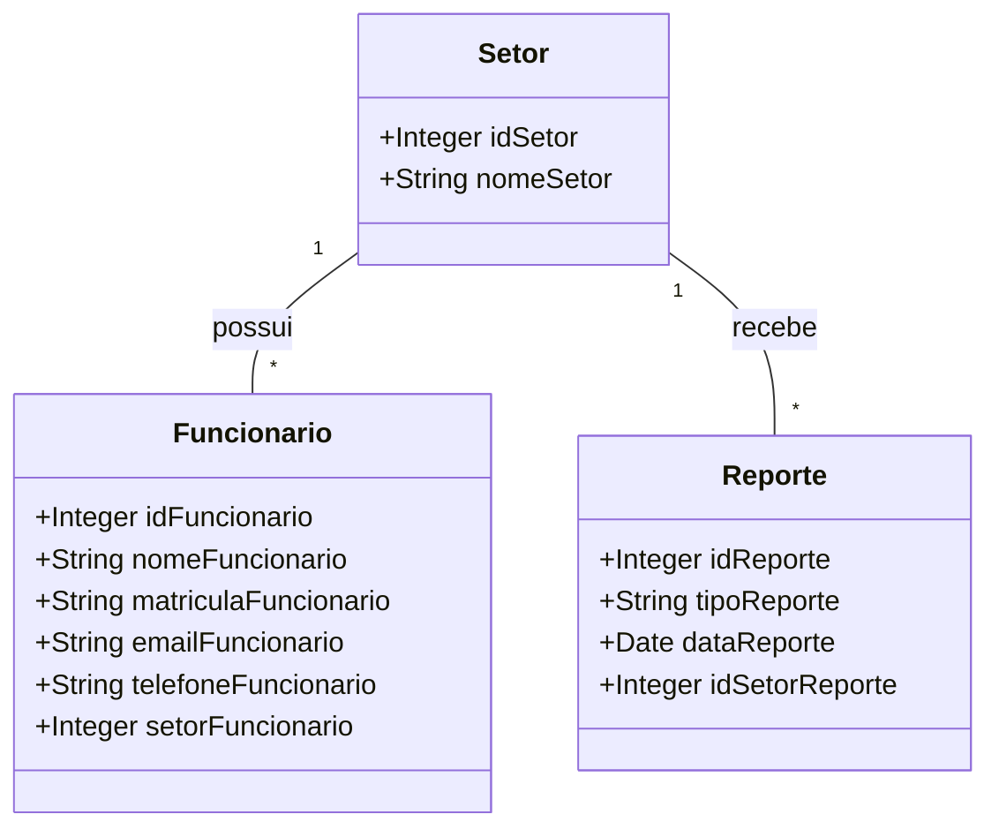

# 📌 Report System API


## Descrição
API para um sistema de monitoramento de ocorrências em fábricas e indústrias. Permite o cadastro, consulta, atualização e remoção de setores, funcionários e relatórios de ocorrências.

##🚀 Tecnologias Utilizadas
- **Java 21**
- **Spring Boot 4.0**
- **MySQL**

##🛠️ Diagrama de Classes

## Estrutura do Banco de Dados
```sql
CREATE DATABASE reportsystem;
USE reportsystem;

CREATE TABLE setor (
    idsetor INT PRIMARY KEY AUTO_INCREMENT,
    nomesetor VARCHAR(100) NOT NULL
);

CREATE TABLE funcionario (
    idfuncionario INT PRIMARY KEY AUTO_INCREMENT,
    nomefuncionario VARCHAR(100) NOT NULL,
    matriculafuncionario VARCHAR(50) NOT NULL UNIQUE,
    emailfuncionario VARCHAR(100) NOT NULL,
    telefonefuncionario VARCHAR(100) NOT NULL,
    setorfuncionario INT,

    CONSTRAINT setor_funcionario
        FOREIGN KEY (setorfuncionario)
        REFERENCES setor(idsetor)
        ON DELETE SET NULL
);

CREATE TABLE reporte (
    idreporte INT PRIMARY KEY AUTO_INCREMENT,
    tiporeporte VARCHAR(100) NOT NULL,
    datareporte DATE NOT NULL,
    idsetorreporte INT,

    CONSTRAINT setor_reporte
        FOREIGN KEY (idsetorreporte)
        REFERENCES setor(idsetor)
        ON DELETE SET NULL
);
```

## 📖 Endpoints da API
### 🔹**Funcionário**
| Método | Endpoint | Descrição |
|---------|---------|------------|
| `POST` | `/funcionario/create` | Cria um novo funcionário |
| `GET` | `/funcionario/read/{id}` | Retorna um funcionário pelo ID |
| `GET` | `/funcionario/readAll` | Retorna todos os funcionários |
| `PUT` | `/funcionario/update/{id}` | Atualiza um funcionário pelo ID |
| `DELETE` | `/funcionario/delete/{id}` | Remove um funcionário pelo ID |

### 🔹**Reporte**
| Método | Endpoint | Descrição |
|---------|---------|------------|
| `POST` | `/reporte/create` | Cria um novo reporte |
| `GET` | `/reporte/read/{id}` | Retorna um reporte pelo ID |
| `GET` | `/reporte/readAll` | Retorna todos os reportes |
| `PUT` | `/reporte/update/{id}` | Atualiza um reporte pelo ID |
| `DELETE` | `/reporte/delete/{id}` | Remove um reporte pelo ID |

### 🔹**Setor**
| Método | Endpoint | Descrição |
|---------|---------|------------|
| `POST` | `/setor/create` | Cria um novo setor |
| `GET` | `/setor/read/{id}` | Retorna um setor pelo ID |
| `GET` | `/setor/readAll` | Retorna todos os setores |
| `PUT` | `/setor/update/{id}` | Atualiza um setor pelo ID |
| `DELETE` | `/setor/delete/{id}` | Remove um setor pelo ID |


## 📄 Licença
Este projeto está sob a licença MIT.

